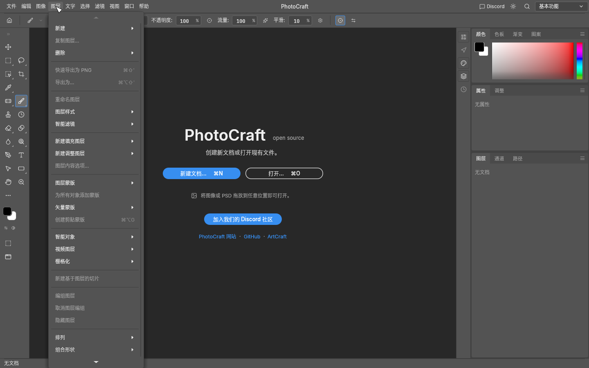
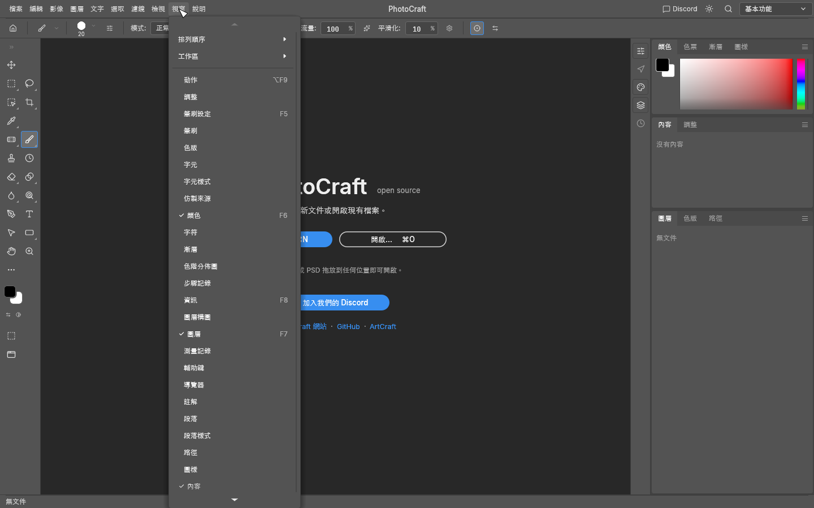
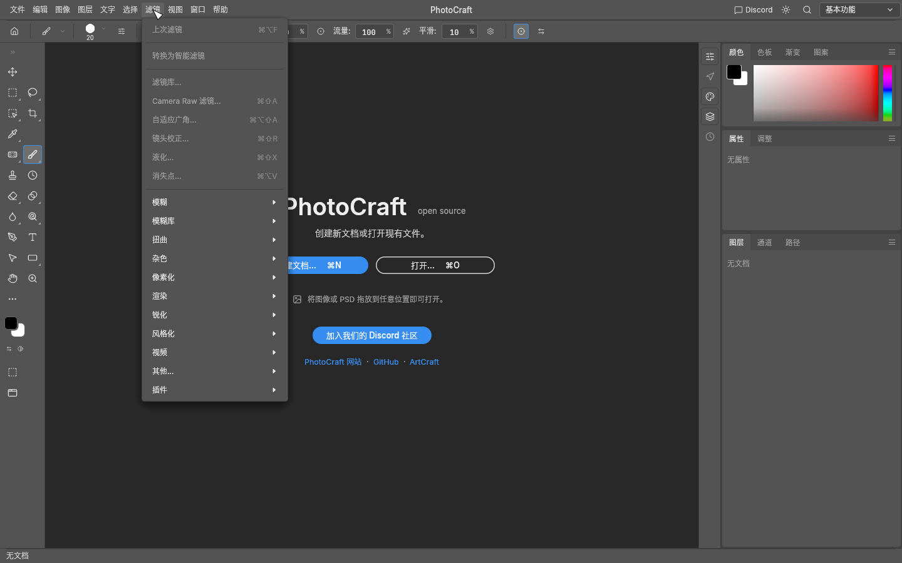
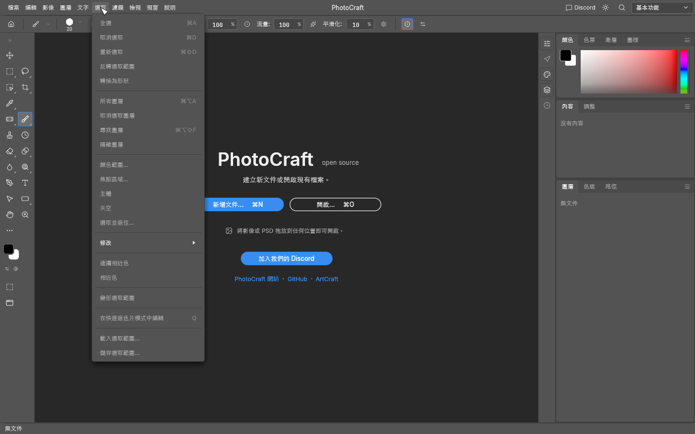

# Chinese UI screenshot gallery

Native PhotoCraft captures at 1440 × 900, rendered offscreen with the `snapshot`
example. Menus are shown with no document open, so unavailable actions appear
dimmed. Product and format names keep their proper spelling.

| Menu | Mainland Simplified (`zh-CN`) | Taiwan Traditional (`zh-TW`) |
| --- | --- | --- |
| File | [文件](zh-hans-menu-file.png) | [檔案](zh-hant-menu-file.png) |
| Edit | [编辑](zh-hans-menu-edit.png) | [編輯](zh-hant-menu-edit.png) |
| Image | [图像](zh-hans-menu-image.png) | [影像](zh-hant-menu-image.png) |
| Layer | [图层](zh-hans-menu-layer.png) | [圖層](zh-hant-menu-layer.png) |
| Type | [文字](zh-hans-menu-type.png) | [文字](zh-hant-menu-type.png) |
| Select | [选择](zh-hans-menu-select.png) | [選取](zh-hant-menu-select.png) |
| Filter | [滤镜](zh-hans-menu-filter.png) | [濾鏡](zh-hant-menu-filter.png) |
| View | [视图](zh-hans-menu-view.png) | [檢視](zh-hant-menu-view.png) |
| Window | [窗口](zh-hans-menu-window.png) | [視窗](zh-hant-menu-window.png) |
| Help | [帮助](zh-hans-menu-help.png) | [說明](zh-hant-menu-help.png) |

## Examples

