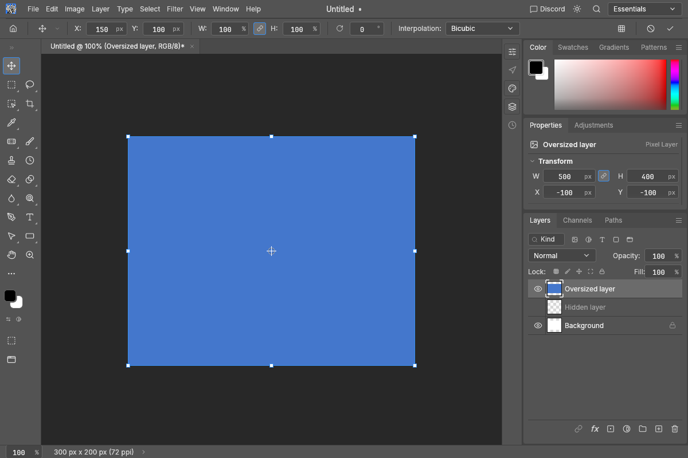
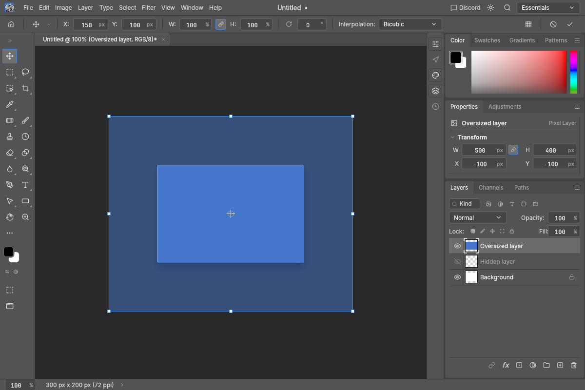
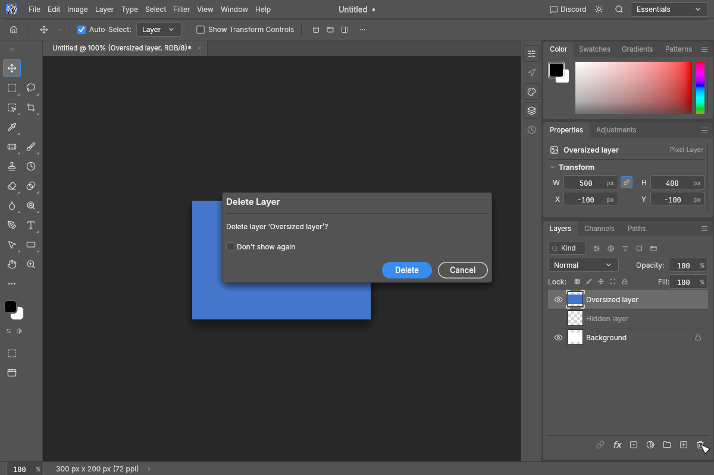

# Layer editing behavior

- Hidden layers show the existing crossed-out eye icon at 30% opacity. Eye-column visibility sweeping is unchanged.
- Plain Delete/Backspace clears pixels with rectangular/elliptical marquee, lasso (including polygonal/magnetic), magic wand, quick selection or object selection tools. Otherwise it deletes the selected layer(s). Text editing and focused widget keys retain their existing handling.
- Deleting a layer selects the next surviving layer below, falling back above. Layer deletion remains undoable.
- Interactive layer deletion asks for confirmation. **Delete** applies it; **Cancel** keeps the layers. **Don't show again** is persisted only after successful confirmed deletion. Pixel clearing, programmatic automation and automatic cleanup of newly created empty text layers do not show this prompt.
- Free/perspective and Warp previews retain normal opacity inside the containing artboard (or ordinary canvas) and half the layer's existing opacity outside. This is a preview effect; committed pixels and layer properties are unchanged. Artboard-group transforms and selection-outline transforms keep their existing behavior.

## Visual comparison

Synthetic 500 × 400 px layer on a 300 × 200 px canvas, rendered offscreen on Windows with the CPU canvas. The before image uses upstream `d2a9295`'s Layers and transform drawing; the after image uses this change. The hidden eye and the canvas edge are visible in the same comparison.

Before:

After:

Deletion confirmation (English UI):

## Verification

- Engine library: 775 passed, 11 ignored.
- UI library: 843 passed, 3 ignored.
- Adversarial command parameters: passed the full-registry panic/hang check.
- Formatting, clippy for both changed crates with all targets, and dependency layering: passed.

Regression coverage includes selected-pixel clearing versus layer removal for Delete/Backspace, neighboring-layer selection with undo/redo, confirmation cancellation, remembered preference loading after restart, changed-document refusal, and non-overlapping inside/outside preview clips with half opacity.
